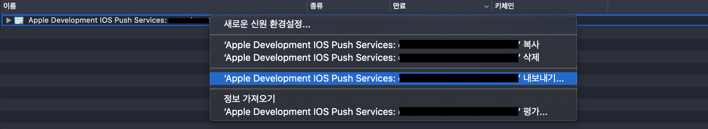
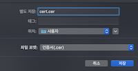
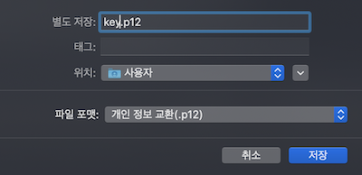
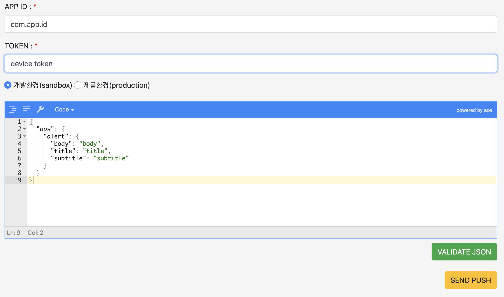

# NodeJS APNs Server

## FEATURE
- [NodeJS](https://nodejs.org)
- [express](https://www.npmjs.com/package/express)
- [node-apn](https://www.npmjs.com/package/apn)

## INSTALL
```shell
$ npm install
```

## START
- development

```shell
$ npm run dev
```
- production

```shell
$ npm run start
```

## SETTING Push Certification
- export cert.cer in keychain access





- export key.p12 in keychain access




- generate cert.cer & key.p12 to .pem files

```
openssl x509 -in cert.cer -inform DER -outform PEM -out cert.pem
openssl pkcs12 -in key.p12 -out key.pem -nodes
```

- setting in apns server options

```js
// sendApns.js
...
options : {
    cert: './apns/keys/cert.pem',
    key: './apns/keys/key.pem'
}
...
```

## SEND Push
- input appID
- input device token
- select production
- validate push contents json


