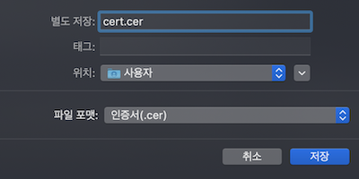

# NodeJS APNs Server

## FEATURE
- [NodeJS](https://nodejs.org)
- [express](https://www.npmjs.com/package/express)
- [node-apn](https://www.npmjs.com/package/apn)

## INSTALL NPM
```shell
$ npm install
```

## START Server
- development
```shell
$ npm run dev
```
- production
```shell
$ npm run start
```

## Generate Push Certification
- export cert.cer in keychain access




- export key.p12 in keychain access


- generate cert.cer & key.p12 to .pem files
```
openssl x509 -in cert.cer -inform DER -outform PEM -out cert.pem
openssl pkcs12 -in key.p12 -out key.pem -nodes
```

### Setting push cetification files
#### v1.0.0
- setting push cetification files in apns server options
```js
// sendApns.js
...
options : {
  cert: './apns/keys/cert.pem',
  key: './apns/keys/key.pem'
}
...
```

#### v2.0.0
- upload push cetification files on sendpush webpage

## WebPage - SEND Push

- upload [push certification files](#generate-push-certification) (v2.0.0)
  - cert file(.pem)
  - key file(.pem)


- input appID
- input device token
- select production (sandbox or production)
- validate push contents json
```json
// example push json format
{
  "aps": {
    "alert": {
      "body": "body",
      "title": "title",
      "subtitle": "subtitle"
    }
  }
}
```

- WebPage


