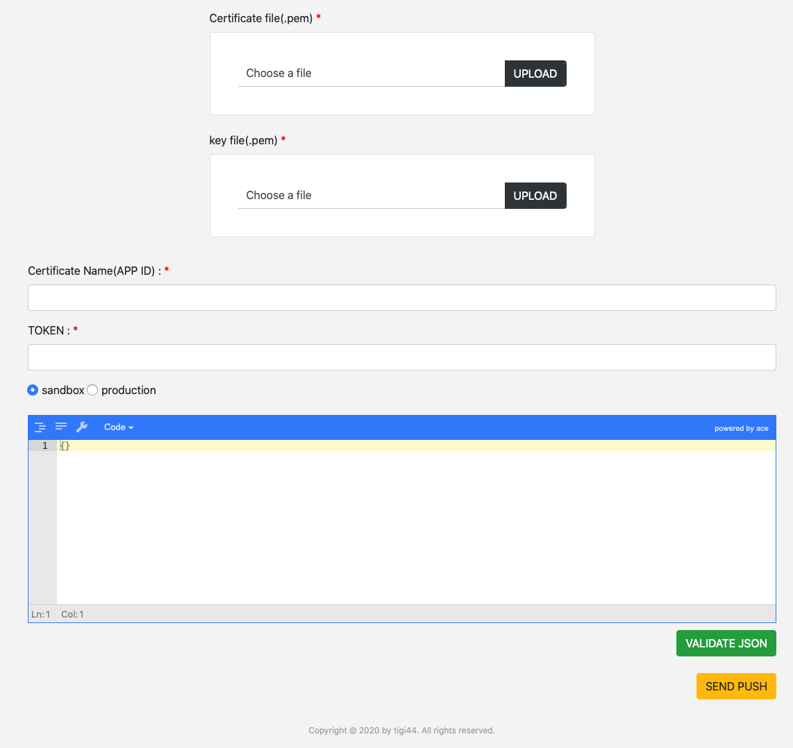

# NodeJS APNs Server


## FEATURE
- [NodeJS](https://nodejs.org)
- [express](https://www.npmjs.com/package/express)
- [node-apn](https://www.npmjs.com/package/apn)

# Install & Start

- Unit Test ([mocha](https://www.npmjs.com/package/mocha))
```shell
$ npm run test
```

- ENV development (default PORT : 13000)
```shell
$ npm ci
$ npm run dev
or
$ npm ci
$ npm run dev-start
```

- ENV production (default PORT : 80)
```shell
$ npm ci
$ npm run start
or
$ npm run deploy
```

## Generate Push Certificate
- export cert.cer in keychain access


- export key.p12 in keychain access


- generate cert.cer & key.p12 to .pem files
```
openssl x509 -in cert.cer -inform DER -outform PEM -out cert.pem
openssl pkcs12 -in key.p12 -out key.pem -nodes
```

### Setting push certificate files

#### v2.0.0
- upload push certificate files on sendpush webpage

## WebPage - SEND Push

- upload [push certificate files](#generate-push-certificate) (v2.0.0)
  - cert file(.pem)
  - key file(.pem)



- input appID
- input device token
- select production (sandbox or production)
- validate push contents json
```json
// example push json format
{
  "aps": {
    "alert": {
      "body": "body",
      "title": "title",
      "subtitle": "subtitle"
    }
  }
}
```

- WebPage


